# internal-dev-portal

A lightweight, Backstage-style internal developer platform: a service catalog
built from `catalog-info.yaml` metadata in each repo, ownership and on-call
info, a dependency graph between services, and a self-service "create new
service" flow wired to a golden-path template.

## Project Status

This is a multi-night build, in progress. See [PROGRESS.md](PROGRESS.md) for
the full architecture writeup, the phased build plan, and exactly where work
resumes next.

## Preview

**Service catalog** — every service registered from `catalog-info.yaml`
metadata, with lifecycle and ownership at a glance.

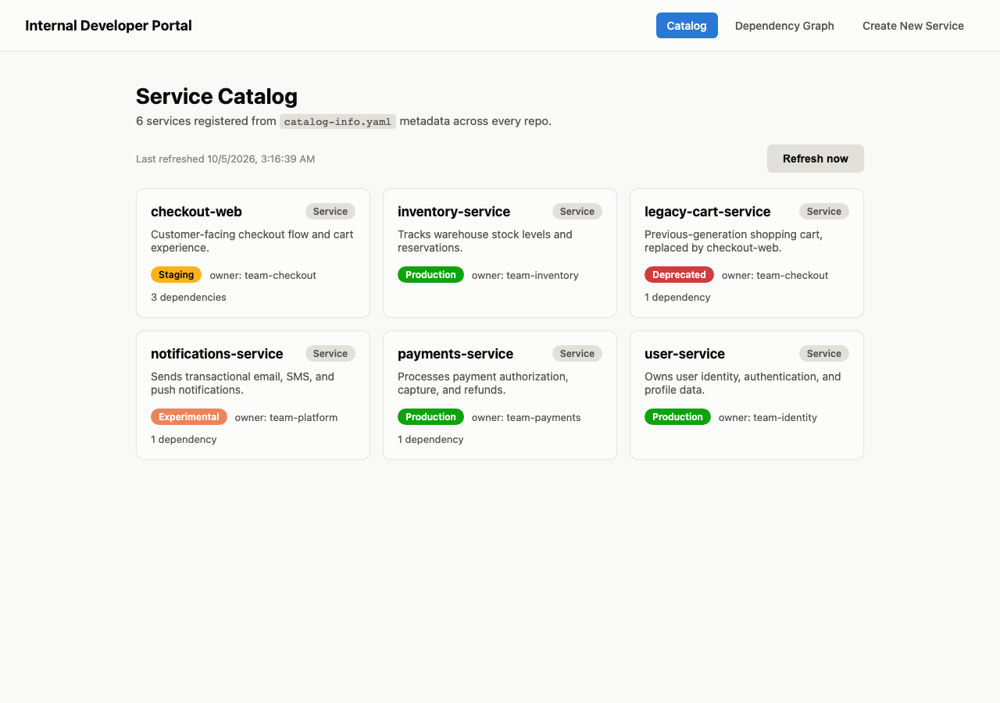

**Service detail** — ownership, on-call rotation, and both directions of the
dependency relationship for a single service.

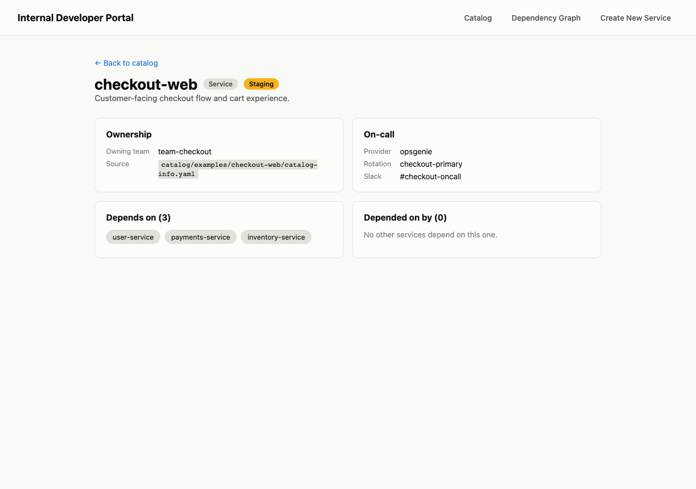

**Dependency graph** — the full service graph, nodes colored by lifecycle
status, arrows pointing from a service to what it depends on.

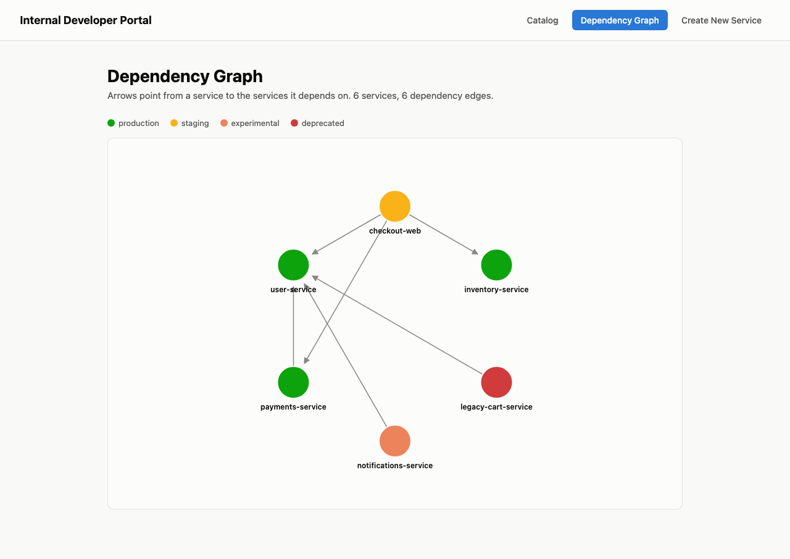

**Self-service create flow** — a form that scaffolds a new service from the
golden-path template.

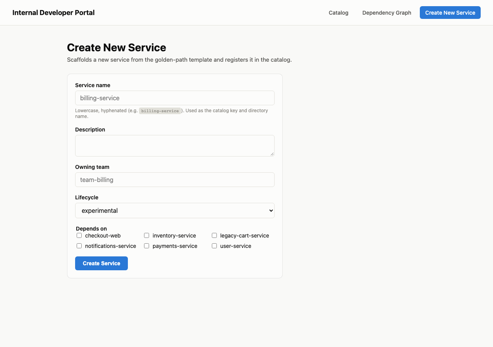

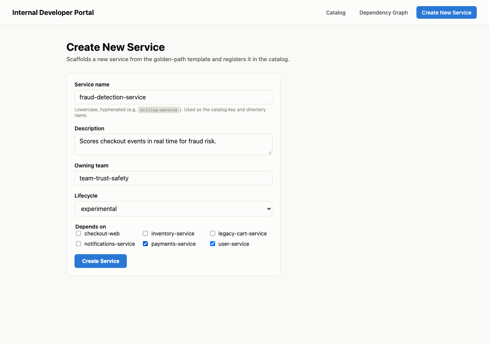

**Scaffold result** — the real files generated on disk and registered in the
catalog immediately.

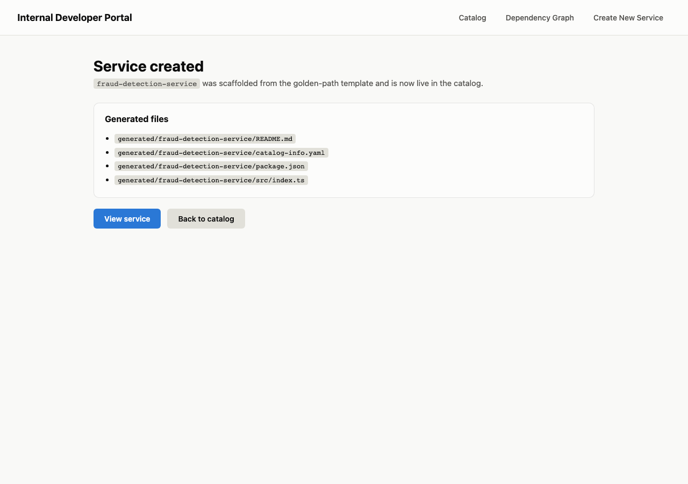

**Catalog after self-service creation** — the new service is live immediately:
the create flow triggers an explicit catalog refresh, no restart, no manual
registration step.

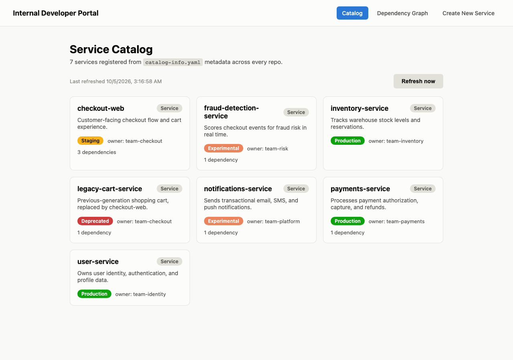

**Catalog validation errors** — a malformed `catalog-info.yaml` is skipped,
not allowed to crash the catalog, and surfaced in a banner instead of silently
disappearing.

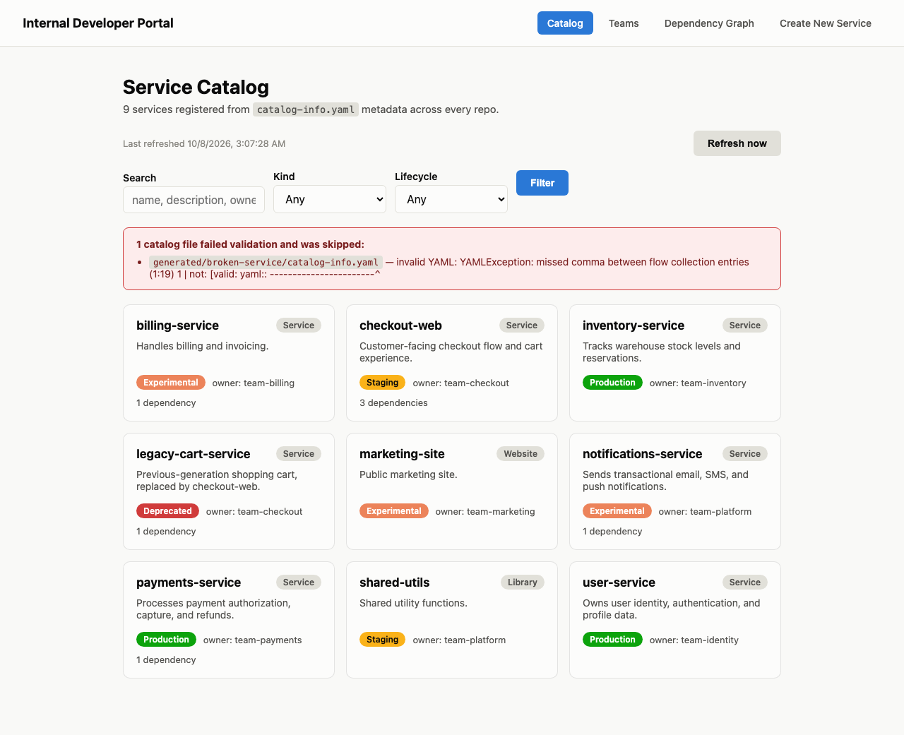

**Teams** — every owner that appears in `spec.owner` across the catalog,
aggregated into a team card: service count, total open incidents, and how
many distinct on-call rotations back it.

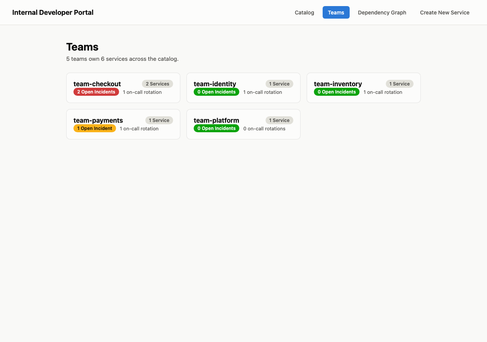

**Team detail** — every service a team owns in one place, its combined
on-call rotations (linked out to the provider when configured), and a
health rollup across the whole team.

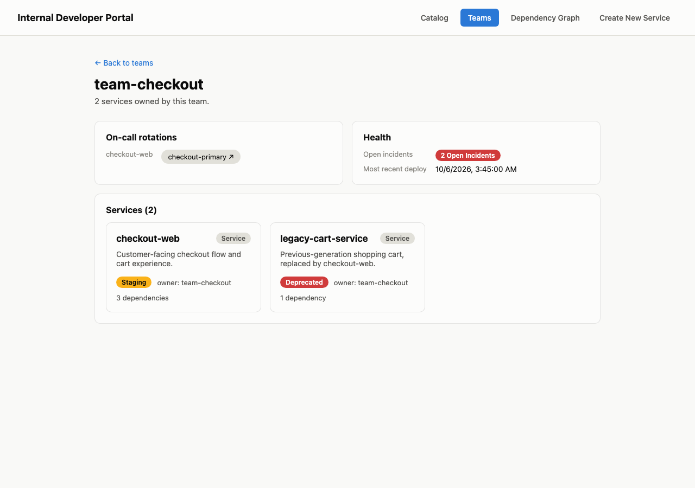

**Service health & on-call escalation** — a `spec.health` block
(`lastDeployAt`, `openIncidents`) renders as a color-coded panel, and when
`PAGERDUTY_SUBDOMAIN`/`OPSGENIE_ORG` is configured, the rotation name becomes
a deep link into that provider's schedule search.

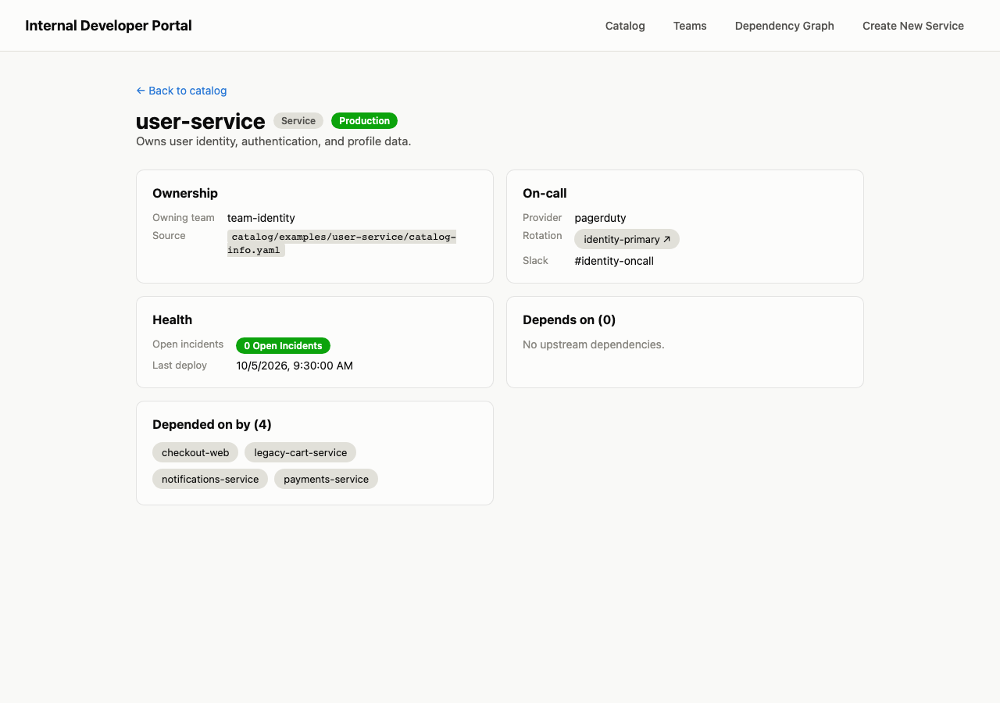

## Architecture

An npm-workspaces monorepo with two TypeScript packages:

- **`@idp/core`** — the domain layer: a Zod schema for `catalog-info.yaml`
  (metadata, ownership, lifecycle, on-call, and an optional `health` block —
  `lastDeployAt` and `openIncidents`), a `CatalogSource` abstraction (local
  directories and a GitHub-repos source, both implementing the same
  interface) feeding a validating catalog loader, a SQLite-backed
  `CatalogStore` that persists the last-loaded snapshot, a scheduler that
  refreshes the store on an interval, a dependency-graph builder with cycle
  detection, and a template engine that renders the golden-path scaffold.
- **`@idp/web`** — a server-rendered Express app (catalog list, service
  detail, team pages, dependency graph, create flow, and an `/admin/refresh`
  trigger) built on top of `@idp/core`. Every page read is a SQLite read, not
  a re-fetch — the catalog only changes on an explicit refresh (scheduled,
  button-triggered, or after the create flow scaffolds a new service). Team
  pages (`/teams`, `/teams/:owner`) group services by `spec.owner` with no
  separate "team" entity — a team is just whatever string appears as an
  owner — and roll up each team's open incidents and on-call rotations.
  When `PAGERDUTY_SUBDOMAIN` or `OPSGENIE_ORG` is set, on-call rotation
  names render as links into that provider's schedule search instead of
  plain text.

Full details, including the source/store abstraction boundary, are in
[PROGRESS.md](PROGRESS.md).

## Getting started

```sh
npm install
npx tsc --build packages/core   # @idp/web imports the compiled @idp/core
npm run dev --workspace=@idp/web
```

Then open `http://localhost:3000`. On startup the server does an initial
catalog refresh and then re-refreshes every 5 minutes by default; both
local-directory and (if configured) GitHub sources are read, validated, and
persisted to a `catalog.db` SQLite file at the repo root.

Optional environment variables:

```sh
PORT=3000                              # server port
CATALOG_REFRESH_INTERVAL_MS=300000     # scheduled refresh interval; 0 disables it
CATALOG_GITHUB_REPOS=acme/widgets,acme/sprockets@main   # owner/repo[@ref], comma-separated
GITHUB_TOKEN=ghp_...                   # only needed for private repos / higher rate limits
PAGERDUTY_SUBDOMAIN=acme               # turns pagerduty rotations into schedule-search links
OPSGENIE_ORG=acme                      # turns opsgenie rotations into schedule-search links
```

## Running tests

```sh
npm test
```

Runs the full suite for both packages: catalog/schema/source/store/scheduler/
graph/template unit tests in `@idp/core`, and route-level integration tests
(including the full create-service flow, the explicit refresh route, team
pages, and on-call escalation links) in `@idp/web`. The GitHub source is
tested with an injected fetch function, so the suite never makes a real
network call.

## Repository layout

```
packages/core/            catalog schema, sources, SQLite store, scheduler, dependency graph, template engine
packages/web/             Express app: catalog UI, service detail, graph, create flow, admin refresh
catalog/examples/         example catalog-info.yaml fixtures (stand-ins for "other repos")
templates/golden-path-service/  the scaffold the self-service flow renders
generated/                where self-service "create new service" writes new services
docs/screenshots/         screenshots used in this README
catalog.db                 (gitignored) persisted catalog snapshot, created on first run
```
